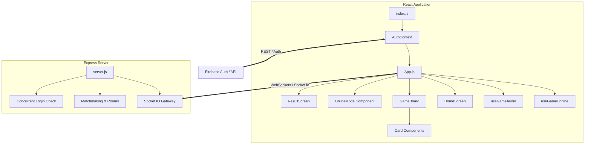

# IPL Trump Game - Technical Project Overview

Welcome to the **IPL Trump Game**! This document provides a complete technical walkthrough and architectural analysis of your project.

---

## 🏗️ Architectural Design & Tech Stack

This project is a premium fullstack JavaScript web application based on a hybrid card battle game paradigm.



### 1. Core Technologies
*   **Frontend Core**: React 19, initialized via Create React App.
*   **Backend Server**: Node.js & Express serving as a custom game state synchronization and socket gateway.
*   **Real-time Protocol**: Socket.IO (version 4.x) utilizing WebSockets (forced under production/Render config) and polling fallback in development.
*   **Database & Authentication**: Firebase Authentication combined with **Firebase Realtime Database** for seamless cross-device cloud saving, loading, and campaign synchronization.
*   **Visual Styling**: Highly advanced Vanilla CSS (`index.css`) featuring custom dark modes, glowing filters, layout glassmorphism, responsive grid flex-boxes, and timeout countdown animations.

---

## 📁 Project Directory Map

Here is a structural breakdown of the codebase files:

```
ipl-trump-game-master/
├── server/                     # Backend server files
│   ├── package.json            # Backend dependencies (Express, Socket.io)
│   ├── players.json            # Local JSON copy of IPL player card database
│   └── server.js               # Node/Socket.io matchmaking and game routing
├── src/                        # Frontend source codebase
│   ├── assets/                 # Game assets, background screens, and back covers
│   ├── components/             # Reusable UI elements & screen wrappers
│   │   ├── Card.js             # Renders a player card, stats, click handler, and glowing timers
│   │   ├── EmotePanel.js       # Real-time emote broadcaster overlay
│   │   ├── GameBoard.js        # Main battle board layout coordinating cards
│   │   ├── GameHeader.js       # Header tracker with round counter, health bars, and timer
│   │   ├── HomeScreen.js       # Game dashboard with rules panel and profile settings
│   │   ├── LoginScreen.js      # Guest & Firebase authenticate router
│   │   └── ResultScreen.js     # Post-game screen featuring custom canvas win particles
│   ├── context/
│   │   └── AuthContext.js      # Global user login provider
│   ├── data/
│   │   ├── players.json        # Database copy for local operations
│   │   └── teamLogos.js        # Logo resolver mappings for teams
│   ├── hooks/
│   │   ├── useGameAudio.js     # Sound effects controls (win, lose, hit, click)
│   │   └── useGameEngine.js    # Standard & Battle state engine hook
│   ├── App.js                  # App root router and global overlays
│   ├── firebase.js             # Initializer config for Firebase SDK
│   ├── index.css               # Premium CSS animations, layouts, and style vars
│   ├── index.js                # Render mount entrypoint
│   └── socket.js               # Global client Socket.io wrapper
├── vercel.json                 # Vercel serverless gateway routing
└── TODO.md                     # Verification checklists
```

---

## 🎮 Interactive Game Modes & Mechanics

The game engine (`useGameEngine.js`) coordinates 4 distinct modes, operating under 4 play styles (AI, Local Multiplayer, Online Multiplayer, Spectator):

| Mode | Objective | Mechanics |
| :--- | :--- | :--- |
| **Classic Mode** | Collect all opponent cards | Choose a stat; higher value wins the round and takes both cards. Draws build up a draw pile. |
| **Time Mode** | Score maximum card wins | Timed match (e.g. 120s) where decisions must be made before timer expiry. Turn time counts down. |
| **Battle Mode** | Reduce opponent HP to 0 | Win stats to inflict damage to enemy HP. HP is computed from margins scaled by `STAT_WEIGHTS`. |
| **Team Mode** | Last franchise standing wins | Restricts play to chosen franchise team decks. Cards captured are kept in the original team pool. |
| **Tournament Mode** | Complete a 9-round season campaign | Play league and playoff matches. Deck sizes dynamically expand based on stakes (7 cards in league, 9 in playoffs, 11 in Grand Final). Maximum 1 tactical swap is allowed per match. |

### Play Styles:
1.  **Play vs AI 🤖**: An intelligent computer opponent. The AI dynamically determines its card type (batsman, bowler, all-rounder) and calculates mathematically optimized stats to play using a custom logarithmic model with randomized weights.
2.  **Local Multiplayer 🎮**: Hot-seat multiplayer on a single device. Turns are fully isolated—the inactive player's card remains turned over until selection.
3.  **Play Online 🌐**: Real-time room creation, custom match codes, and team draft screens powered by Socket.IO.
4.  **Spectate Mode 👁️**: Auto AI vs AI match viewing. Spectator mode allows watching non-player matches (or playoff rounds) play out dynamically with both cards visible on screen.

### Custom Advanced Gameplay Mechanics:
*   **Cricket "Over" Turn Rotation**: To prevent one-sided games, the game tracks active turn control streaks. If a player maintains the turn for **3 consecutive rounds** (one "Over"), the turn automatically rotates to the opponent, keeping the match balanced and engaging.
*   **Unpredictable, Randomized Round Stages**: In Tournament and Team modes, the active round stage (**Powerplay**, **Middle Overs**, or **Death Overs**) is randomly assigned at the start of each round rather than alternating in a predictable order.
*   **Zero-Cost Deterministic Random Sync**: In online multiplayer, round stage randomization is calculated using a high-frequency sine function of the current round number. Since both clients execute identical math on the identical round, they calculate the exact same active stage, achieving **100% serverless synchronization** with zero lag!

---

## 🛡️ Robust Security & UX Optimization Details

Your code includes several key optimizations and security mechanisms:

*   **Achievement System & Auto-Dismiss Toast**: Tracks player accomplishments (e.g., winning margins, remaining time, coming from behind) and triggers visual toast notifications upon unlock. Toast alerts are equipped with a **4-second auto-dismiss timer** as well as touch-to-dismiss capabilities.
*   **Landscape Release on Match Finish**: Reorientation lock to landscape is immediately released upon match termination (e.g., deck size reaching 0, HP reaching 0, or timer expiring). This allows the post-match **Result Screen** to render in user-friendly portrait mode.
*   **State-Clearing on Exit**: Exiting a match back to the Home Screen completely clears and resets all state variables in `useGameEngine` to prevent gameplay loops and sound effects from running in the background.
*   **Concurrent Session Prevention**: The backend monitors active users (`activeUsers`) and immediately triggers a `loginConflict` event if the same displayName tries to connect from another client socket, automatically logging out the stale session.
*   **Server-Side Stat Validation**: In `server.js`, a strict allowlist (`VALID_STATS`) rejects any client-transmitted stats that do not match real parameters (e.g. preventing cheating via inspector tools).
*   **Socket Multi-Emitter Cleanup**: All event listeners in `OnlineMode.js` and `useGameEngine.js` explicitly clean up specific named references to avoid duplicate event execution on reconnect.
*   **Stale-Closure Prevention**: `useGameEngine` keeps state references inside stable `useRef` instances (like `drawPileRef` and `handleStatClickRef`) to prevent asynchronous callbacks from executing against old React renders.
*   **Timeout & Visual Micro-Animations**: Card timeout indicators are drawn dynamically using SVG rect progress animations synchronized directly with turn remounts, providing highly premium feedback.
*   **Cross-Device Cloud Syncing**: Standard game progress and active tournament campaigns are automatically synchronized to Firebase Realtime Database. Data is isolated using unique authenticated user ID prefixes (`users/${user.uid}/...`), allowing players to seamlessly transition from phone to laptop. Unauthenticated guest players fall back safely to browser-level LocalStorage.
*   **Tactical Swap Timer Pausing**: Clicking the "Tactical Swap" button completely pauses the main round turn countdown and unmounts the visual glowing progress card border. A separate **5-second warning countdown** badge renders inside the swap modal. If no candidate is selected within 5 seconds, the modal automatically closes and the main turn timer resumes.
